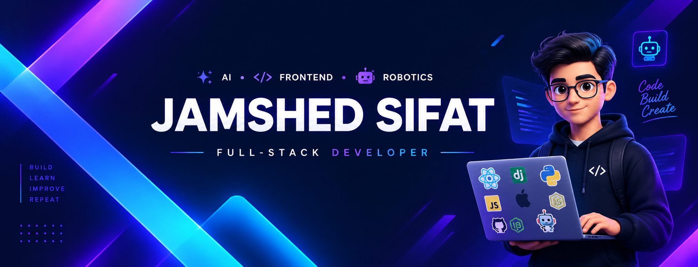

  

  

---

# Hi, I'm Jamshed Sifat 👋

### Computer Science Student • Full-Stack Developer • AI Builder

I'm passionate about building **AI-powered web applications** that solve real-world problems using **React, Django, and modern web technologies**.

- 🚀 Building production-ready web applications
- 🤖 Exploring AI integration and intelligent workflows
- 🎨 Focused on clean UI, scalable backend systems, and real-world products

---

# 🚀 Currently Building

- 🤖 AI Resume Auditor
- 🎯 Job Fit Analyzer
- 🎤 AI Interview Platform
- 🌙 Deen Companion
- 🌐 React + Django Full-Stack Applications

---

# 🛠 Tech Stack

### Frontend

  

### Backend

  

### Database

  

### Tools

  

### Robotics

  
  

---

# 💻 Programming Languages

  

---

# 🌟 Featured Projects

| Project | Description |
|---------|-------------|
| 🤖 **AI Resume Auditor** | Resume analysis with ATS-focused AI feedback |
| 🎯 **Job Fit Analyzer** | AI-powered job matching |
| 🌙 **Deen Companion** | Islamic productivity platform |
| 🏥 **SmartHealthCare** | Django healthcare application |
| ⚽ **SportNest** | Sports management platform |
| 🔥 **Fire Fighting Robot** | Arduino embedded project |

---

# 📊 GitHub Analytics

---

# 🌐 Most Used Languages

---

# 📈 Contribution Graph

---

# 🐍 Contribution Snake

<picture>
  <source media="(prefers-color-scheme: dark)" srcset="https://raw.githubusercontent.com/JamshedSifat/JamshedSifat/output/github-contribution-grid-snake-dark.svg"/>
  <source media="(prefers-color-scheme: light)" srcset="https://raw.githubusercontent.com/JamshedSifat/JamshedSifat/output/github-contribution-grid-snake.svg"/>
  
</picture>

---

# 🤝 Connect With Me

---

> **Build • Learn • Improve • Repeat**

